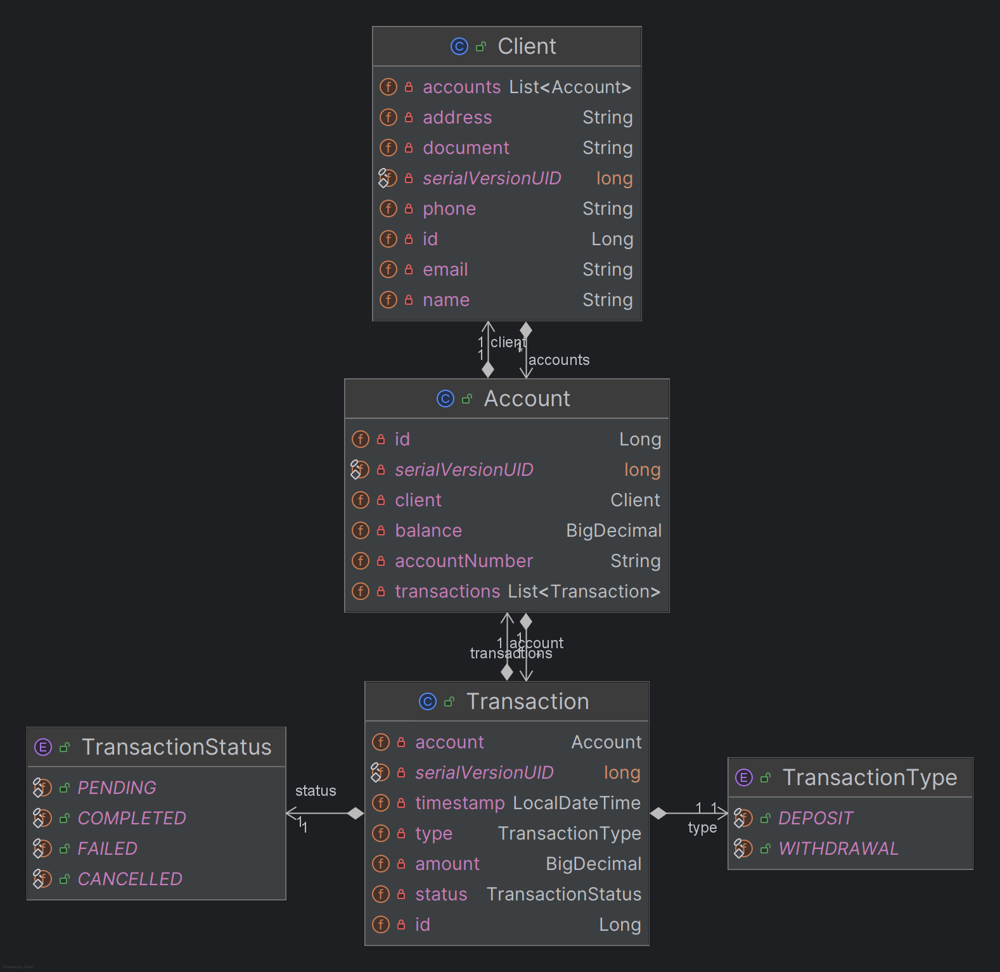

# VBank API


## 🏦 Project Description

VBank is a core banking API designed to manage clients, digital accounts, and financial transactions. This project serves as a robust and scalable backend solution, built with Java and Spring Boot, demonstrating best practices in REST API design, advanced data querying, and clean architecture.

The system provides a complete CRUD interface for client and account management, along with a secure transaction processing engine for deposits and withdrawals.

## ✅ Project Status

**Last Updated:** 2025-08-23

### ✨ Main Features

-   **Layered Architecture** with a clear separation of concerns (Controllers, Services, Repositories, Mappers).
-   **Complete Client Management** (Create, Read, Update, Delete).
-   **Complete Account Management** (Create, Read, Delete with business rule validation).
-   **Transactional Operations** for deposits and withdrawals with balance updates.
-   **Search and Filtering** for all entities using JPA Specifications.
-   **Pagination and Sorting** on all list endpoints.
-   **Error Handling** with a global `@ControllerAdvice` for `404`, `400`, and `422` error responses.
-   **Input Validation** on DTOs.
-   **Interactive API Documentation** via Swagger/OpenAPI.

---

## ⚙️ Setup & Configuration

### Prerequisites
-   Java 21 JDK
-   PostgreSQL 15+
-   Maven 3.9+
-   An IDE (e.g., IntelliJ, VSCode) or a terminal.

### How to Run the Project

1.  **Clone the repository:**
    ```bash
    git clone https://github.com/EduardoXDuardo/vbank.git
    cd vbank
    ```

2.  **Configure the Database:**
    -   Ensure you have a running instance of PostgreSQL.
    -   Create a new database named `vbank`.
    -   In the `src/main/resources/` directory, rename `application.properties.example` to `application.properties`.
    -   Open the new `application.properties` and enter your local PostgreSQL username and password.

3.  **Run the Application:**
    ```bash
    mvn spring-boot:run
    ```
    The API will be available at `http://localhost:8080`. The database tables will be created and populated with sample data automatically on the first run.

---

## 🔧 ️Technologies

-   **Backend:** Java 21, Spring Boot 3
-   **Data:** Spring Data JPA, Hibernate, PostgreSQL
-   **Advanced Querying:** JPA Specifications
-   **Documentation:** SpringDoc OpenAPI (Swagger UI)
-   **Build Tool:** Maven
-   **Code Quality:** Lombok

---

## 🏛️ Project Architecture

### Model-Entity Relationship (MER)
The data model was designed with three main entities: Client, Account, and Transaction. A Client can have multiple Accounts, and an Account can have multiple Transactions, establishing one-to-many relationships.

### Entity-Relationship Diagram (ERD)


### Database Scripts

The scripts for creating the database schema (`ddl.sql`) and populating it with sample data (`data.sql`) are available in the `src/main/resources` folder.

<details>
<summary><b>📜 DDL Script (`src/main/resources/ddl.sql`)</b></summary>

```sql
-- DDL SCRIPT FOR VBank DATABASE
-- Generated by Hibernate

-- Step 1: Create Tables
CREATE TABLE clients (
    id bigserial NOT NULL,
    address varchar(255) NOT NULL,
    document varchar(14) NOT NULL,
    email varchar(255) NOT NULL,
    name varchar(255) NOT NULL,
    phone varchar(11) NOT NULL,
    PRIMARY KEY (id)
);

CREATE TABLE accounts (
    id bigserial NOT NULL,
    account_number varchar(255) NOT NULL,
    balance numeric(38,2) NOT NULL,
    client_id bigint NOT NULL,
    PRIMARY KEY (id)
);

CREATE TABLE transactions (
    id bigserial NOT NULL,
    amount numeric(38,2) NOT NULL,
    status varchar(255) NOT NULL CHECK (status IN ('PENDING','COMPLETED','FAILED','CANCELLED')),
    "timestamp" timestamp(6) NOT NULL,
    type varchar(255) NOT NULL CHECK (type IN ('DEPOSIT','WITHDRAWAL')),
    account_id bigint NOT NULL,
    PRIMARY KEY (id)
);

-- Step 2: Add Unique Constraints
ALTER TABLE IF EXISTS clients ADD CONSTRAINT UK_clients_document UNIQUE (document);
ALTER TABLE IF EXISTS clients ADD CONSTRAINT UK_clients_email UNIQUE (email);
ALTER TABLE IF EXISTS clients ADD CONSTRAINT UK_clients_phone UNIQUE (phone);
ALTER TABLE IF EXISTS accounts ADD CONSTRAINT UK_accounts_account_number UNIQUE (account_number);

-- Step 3: Add Foreign Key Constraints
ALTER TABLE IF EXISTS accounts
   ADD CONSTRAINT FK_accounts_to_clients
   FOREIGN KEY (client_id)
   REFERENCES clients;

ALTER TABLE IF EXISTS transactions
   ADD CONSTRAINT FK_transactions_to_accounts
   FOREIGN KEY (account_id)
   REFERENCES accounts;
```
</details>

<details>
<summary><b>📜 DML Script (`src/main/resources/data.sql`)</b></summary>

```sql
-- DML SCRIPT FOR VBank DATABASE
-- Sample data for testing

-- Insert clients
INSERT INTO clients (id, name, document, email, phone, address) VALUES
(1, 'Luiz Eduardo da Silva', '11122233344', 'luiz.e.silva@email.com', '11987654321', 'Rua Bem Legal, 123, São Paulo, SP'),
(2, 'Douglas Castelluber', '22233344455', 'douglas.castelluber@email.com', '11912345678', 'Avenida da Felicidade, 456, São Paulo, SP');

-- Insert accounts for clients
INSERT INTO accounts (id, client_id, account_number, balance) VALUES
(1, 1, '0001-1', 1500.75), -- Luiz's account
(2, 2, '0002-1', 850.25);  -- Douglas's account

-- Insert transactions for accounts
INSERT INTO transactions (id, account_id, type, status, amount, "timestamp") VALUES
(1, 1, 'DEPOSIT', 'COMPLETED', 500.00, '2025-08-19 10:00:00'),
(2, 1, 'WITHDRAWAL', 'COMPLETED', 150.25, '2025-08-20 14:30:00'),
(3, 2, 'DEPOSIT', 'COMPLETED', 1000.00, '2025-08-20 09:15:00');

-- Since bigserial is used, the sequence for the ID needs to be updated
-- to avoid conflicts if the application tries to insert new records.
SELECT setval('clients_id_seq', (SELECT MAX(id) FROM clients));
SELECT setval('accounts_id_seq', (SELECT MAX(id) FROM accounts));
SELECT setval('transactions_id_seq', (SELECT MAX(id) FROM transactions));
```
</details>

---

## 🔑 API Endpoints

The complete and interactive API documentation is available via Swagger UI.

### 📖 API Documentation with Swagger
Once the application is running, the interactive Swagger UI can be accessed at:
`http://localhost:8080/swagger-ui.html`

### 🧪 API Testing with Postman

This project includes a Postman collection with all the available endpoints for easy testing and exploration.

Click the button below to import the collection into your Postman application:

[](https://www.postman.com/luizdudu35/workspace/public-projects/collection/46291934-d2066ed0-ac24-4854-9983-0384dc4f7c8e?action=share&creator=46291934)

The UI provides detailed information on all available endpoints, parameters, request bodies, and response schemas, and allows for direct API testing from the browser.

<details>
<summary><b>Client Endpoints (`/api/clients`)</b></summary>

| Method | Route | Description |
| :--- | :--- | :--- |
| `GET` | `/api/clients` | Searches for clients with optional filters (name, document, etc.) and pagination. |
| `GET` | `/api/clients/{id}` | Retrieves a specific client by their ID. |
| `POST` | `/api/clients` | Creates a new client. |
| `PATCH` | `/api/clients/{id}`| Partially updates an existing client. |
| `DELETE`| `/api/clients/{id}`| Deletes a client. |

</details>

<details>
<summary><b>Account Endpoints (`/api/accounts`)</b></summary>

| Method | Route | Description |
| :--- | :--- | :--- |
| `GET` | `/api/accounts` | Searches for accounts with optional filters (clientId, accountNumber) and pagination. |
| `GET` | `/api/accounts/{id}` | Retrieves a specific account by its ID. |
| `POST` | `/api/accounts` | Creates a new account for an existing client. |
| `DELETE`| `/api/accounts/{id}`| Deletes an account (only if the balance is zero and there are no pending transactions). |

</details>

<details>
<summary><b>Transaction Endpoints (`/api/transactions`)</b></summary>

| Method | Route | Description |
| :--- | :--- | :--- |
| `GET` | `/api/transactions` | Searches for transactions with advanced filters (accountId, type, date/amount range) and pagination. |
| `GET` | `/api/transactions/{id}`| Retrieves a specific transaction by its ID. |
| `POST` | `/api/transactions` | Creates a new transaction (deposit or withdrawal), updating the corresponding account balance. |

</details>

---

## 💡 Design Decisions & Architecture Highlights

This project incorporates several professional design patterns and best practices:

-   **Layered Architecture:** The project follows a clean architecture with distinct layers for Controllers (handling HTTP requests), Services (business logic), Repositories (data access), and Mappers (DTO-Entity conversions). This separation of concerns enhances maintainability and testability.
-   **Paginated Responses:** All endpoints that can return a list of resources are paginated using Spring's `Pageable` interface to ensure API performance and scalability.
-   **JPA Specifications:** Instead of simple queries, the API uses JPA Specifications for all search endpoints. This allows for clean, type-safe, and dynamic query building based on optional filter criteria.
-   **`PATCH` for Update:** The client update endpoint uses the `PATCH` HTTP method for partial updates, a more flexible and efficient approach than `PUT`.
-   **Immutability of Financial Records:** The API intentionally does not expose `UPDATE` or `DELETE` endpoints for Transactions. Once a transaction is completed, it is treated as an immutable historical record to ensure a clear and reliable audit trail, which is a critical practice in financial systems.
-   **Centralized Exception Handling:** A global `@ControllerAdvice` intercepts custom business exceptions (`ResourceNotFoundException`, `BusinessViolationException`) and validation errors (`MethodArgumentNotValidException`), providing standardized and informative JSON error responses with the correct HTTP status codes (`404`, `400`, `422`).
-   **Data Normalization:** Sensitive identifiers like CPF/CNPJ and phone numbers are stored as raw digits in the database to ensure data consistency, improve search performance, and simplify validation. Formatting is treated as a presentation-layer concern.

---

## 🛣️ Roadmap & Next Steps

While the core requirements have been fully implemented, there are several potential enhancements and features that could be added in future iterations:

-   **Asynchronous Transaction Processing:** Refactor the transaction creation logic to be asynchronous. The API would create a `PENDING` transaction and publish an event to a message queue (e.g., RabbitMQ, Kafka, or SQS). A separate consumer would process the transaction, updating its final status to `COMPLETED` or `FAILED`. This would increase the API's responsiveness and resilience.
-   **Authentication & Authorization:** Implement a security layer using Spring Security and JWT to ensure that users can only access and manage their own financial resources.
-   **Comprehensive Unit and Integration Testing:** Create tests to cover all service-layer business logic and API endpoint behaviors.
-   **Containerization and Deployment:** Create a `Dockerfile` for the application and a `docker-compose.yml` file to orchestrate the API and the PostgreSQL database for easy deployment to a cloud environment.

---

## 📄 License
This project is licensed under the MIT License - see the `LICENSE` file for details.
